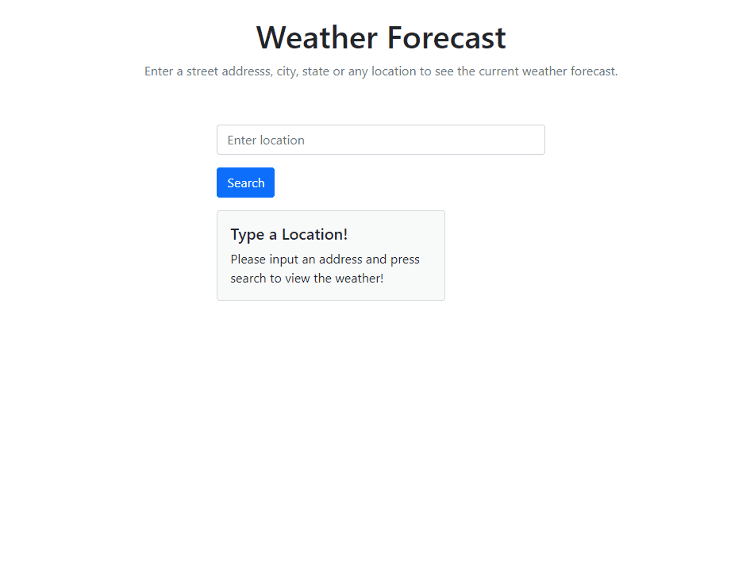

# Weather Forecast app
A weather forecast app that allows the user to enter an address, city/state, and any location to view the current forecast. This app was built using Node.js, Express.js and React.js along with React-Bootstrap.

You can try it out and view the deployed app [here on Heroku](https://jordanally-weather-app.herokuapp.com/)

## Goals
My purpose in building this weather app was to create a fullstack app that included a backend server and a client. Separating the client from the server, creating routes on the backend, requesting from the client and deploying to production helped solidify my knowledge in separating those client/server concerns. This was also an opportunity for me to use React hooks on the frontend side. 

## Takeaways
- Build and connect React.js front end with Node.js/Express.js backend
- Learn React.js hooks (useEffect for side-effects and useState for updating state) and Fragments (for easy conditional rendering)
- Get more familiar with Express.js routers and creating useful status codes and messages for the client

